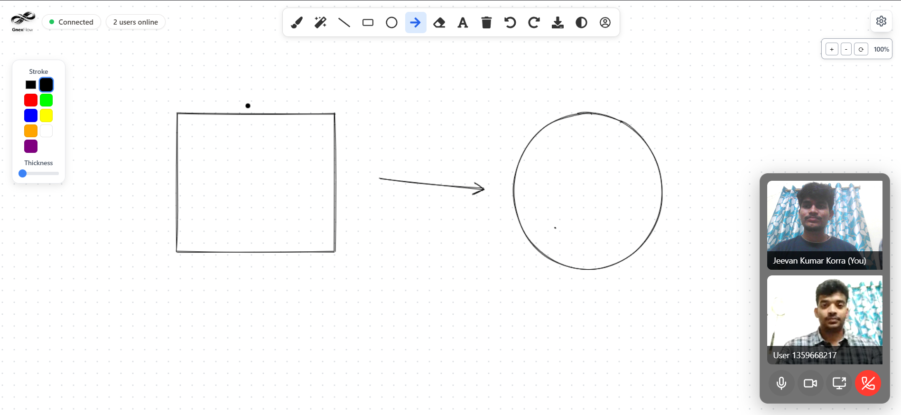
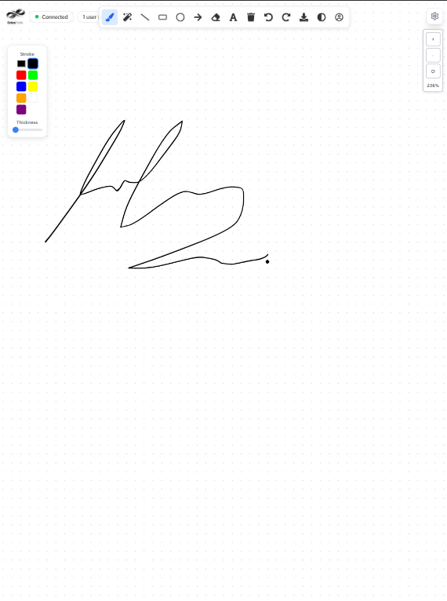
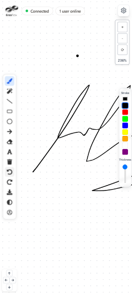

#  GnexFlow - The AI-Powered Collaborative Whiteboard 

[](https://reactjs.org/)
[](https://nodejs.org/)
[](https://socket.io/)
[](https://www.tensorflow.org/js)
[](https://www.mongodb.com/)

**GnexFlow** is a feature-rich, real-time collaborative whiteboard designed for seamless creative and professional collaboration. It goes beyond traditional whiteboards by integrating live video calls and a powerful AI brush that recognizes hand-drawn shapes and text, transforming rough sketches into polished diagrams and notes instantly.

<div align="center">
  
</div>

---

##  Core Features

GnexFlow is packed with features to make collaboration intuitive, powerful, and fun.

* **Real-Time Collaboration:**
    * **Live Multi-User Editing:** See changes from your collaborators appear on your canvas instantly.
    * **Live Cursors:** Track your team's cursors in real-time to see who is doing what.
    * **User Presence:** A live list shows who is currently active in the canvas room.

* **Integrated Video Calling:**
    * **In-App Communication:** Start a high-quality video and audio call directly within the canvas room using **Agora RTC**.
    * **Screen Sharing:** Share your screen with collaborators for presentations or technical demonstrations.
    * **Call Controls:** Full control over your media with mute/unmute and camera on/off toggles.

* **AI-Powered Drawing Assistant:** 
    * **Algorithmic Shape Recognition:** An intelligent brush that automatically perfects simple hand-drawn shapes like lines, circles, and rectangles.
    * **Machine Learning Recognition:** A sophisticated AI brush powered by **TensorFlow.js** that recognizes complex shapes and even converts **handwritten** letters and numbers into clean text elements.

* **Infinite Canvas & Tools:**
    * **Limitless Space:** An infinite canvas with intuitive **pan and zoom** controls.
    * **Comprehensive Toolset:** Includes a standard brush, line, arrow, various shapes, text tool, and an eraser.
    * **Customization:** A draggable toolbox lets you customize stroke color, fill color, and brush/text size.
    * **Undo/Redo:** Easily correct mistakes with multi-level undo and redo functionality.

* **User & Canvas Management:**
    * **Secure Authentication:** Robust user authentication with email/password (bcrypt hashing) and **Google OAuth 2.0**.
    * **Personal Gallery:** A personal dashboard to create, view, manage, and delete all your canvases.
    * **Canvas Sharing:** Securely share your canvases with other registered users to collaborate.
    * **Guest Mode:** Try out the whiteboard without an account. Your work is saved locally and can be migrated to your account upon signing up.
    * **Export:** Download your finished canvas as a high-quality PNG image.

* **Modern UI/UX:**
    * **Dark Mode:** A sleek, eye-friendly dark mode for comfortable use in low-light environments.
    * **Responsive Design:** A clean and intuitive interface that works seamlessly on modern web browsers.

<div style="display: flex; align-items: flex-start; gap: 2%;">
    
    
</div>

---

##  Tech Stack

GnexFlow is built with a modern, powerful, and scalable technology stack.

### Frontend
* **Framework:** React.js
* **Routing:** React Router
* **State Management:** React Context API with `useReducer` for predictable and scalable state management.
* **Real-Time Communication:** Socket.IO Client
* **Video RTC:** Agora RTC SDK for Web
* **Machine Learning:** TensorFlow.js for in-browser inference.
* **Canvas Rendering:** HTML5 Canvas API & Rough.js for a hand-drawn aesthetic.
* **Styling:** CSS Modules, Tailwind CSS utility classes.
* **API Communication:** Axios

### Backend
* **Framework:** Node.js with Express.js
* **Database:** MongoDB with Mongoose ODM.
* **Real-Time Communication:** Socket.IO
* **Authentication:** JSON Web Tokens (JWT) & bcrypt for password hashing.
* **Video Token Server:** Agora for generating RTC tokens.
* **CORS:** `cors` package for handling cross-origin requests.

### Machine Learning
* **Framework:** Python with TensorFlow & Keras for model training.
* **Datasets:**
    * Custom-generated dataset for geometric shapes (circles, rectangles etc.).
    * EMNIST (ByClass) dataset for handwriting recognition (62 classes: 0-9, A-Z, a-z).

---

##  Getting Started

To get a local copy up and running, follow these simple steps.

### Prerequisites

* Node.js (v18 or later)
* npm
* MongoDB instance (local or cloud like MongoDB Atlas)
* Python environment for running ML training scripts (optional)
* An Agora Developer Account for Video Call functionality.

### Installation

1.  **Clone the repository:**
    ```sh
    git clone https://github.com/your-username/GnexFlow.git
    cd waveboard
    ```

2.  **Install Backend Dependencies:**
    ```sh
    cd server
    npm install
    ```

3.  **Install Frontend Dependencies:**
    ```sh
    cd ../waveboard
    npm install
    ```

### Configuration

1.  **Backend Environment Variables:**
    Create a `.env` file in the `backend` directory and add the following:
    ```env
    PORT=5000
    MONGO_URI=your_mongodb_connection_string
    JWT_SECRET=your_super_secret_jwt_key
    FRONTEND_URL=http://localhost:3000
    AGORA_APP_ID=your_agora_app_id
    AGORA_APP_CERTIFICATE=your_agora_app_certificate
    ```

2.  **Frontend Environment Variables:**
    Create a `.env` file in the `frontend` directory and add the following:
    ```env
    REACT_APP_BACKEND_URL=http://localhost:5000
    REACT_APP_GOOGLE_CLIENT_ID=your_google_oauth_client_id
    REACT_APP_AGORA_APP_ID=your_agora_app_id
    ```

### Running the Application

1.  **Start the Backend Server:**
    From the `backend` directory:
    ```sh
    npm run dev
    ```

2.  **Start the Frontend Development Server:**
    From the `frontend` directory:
    ```sh
    npm start
    ```

Open [http://localhost:3000](http://localhost:3000) to view it in your browser.

---

##  Machine Learning Models

The AI Brush feature is powered by two custom-trained CNN models. The training scripts are located in the `/ml` directory.

1.  **Shape Recognition Model:** Trained on a programmatically generated dataset of 5 shapes (circle, rectangle, triangle, diamond, star).
2.  **Handwriting Recognition Model:** Trained on the EMNIST dataset, capable of recognizing 62 alphanumeric characters.

The trained models are converted to the TensorFlow.js format and served statically from the frontend's `/public` folder for client-side inference, ensuring low latency.

---
